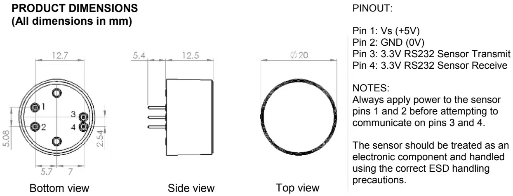
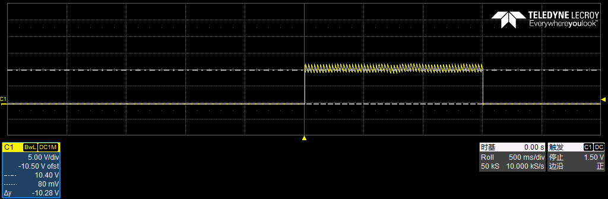
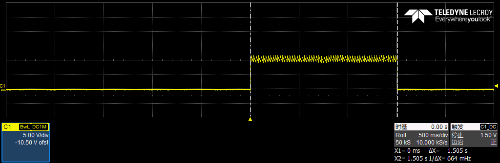

### 氧气传感器文档说明

### 氧气传感器接线

#### `这个图中存在一处错误 3脚和4脚 不是RS232而是TTL信号！！！！！`

### JP5接线 
| AMR管脚 | ARM配置 | 接插件位置 |  备注 |
| :----| :---- | :---: | :--- |
| PC12 | UART5TX|J5-6 | 用于连接串口助手，建议使用这个|
| PD2  | UART5RX|J5-5 ||
| ---  | SDIO|J5-4 ||
| ---  | SCLK|J5-3 ||
|      | GND|J5-2  ||
|      | 3.3V|J5-2 ||

串口助手下载[我使用的串口助手链接](https://www.comassistant.cn/)

### GD芯片输出信号
用示波器测量到触发信号脉宽和伏值如下

`伏值如下`

`脉宽如下`

### 程序修改
1. 加入了调试串口输出信息，可以观察当前板卡的当前状态
2. 加入了进入了相应的状态后，关串口中断，杜绝运行时解析数据，在相应的模式运行完毕后，才去再次开启串口中断

